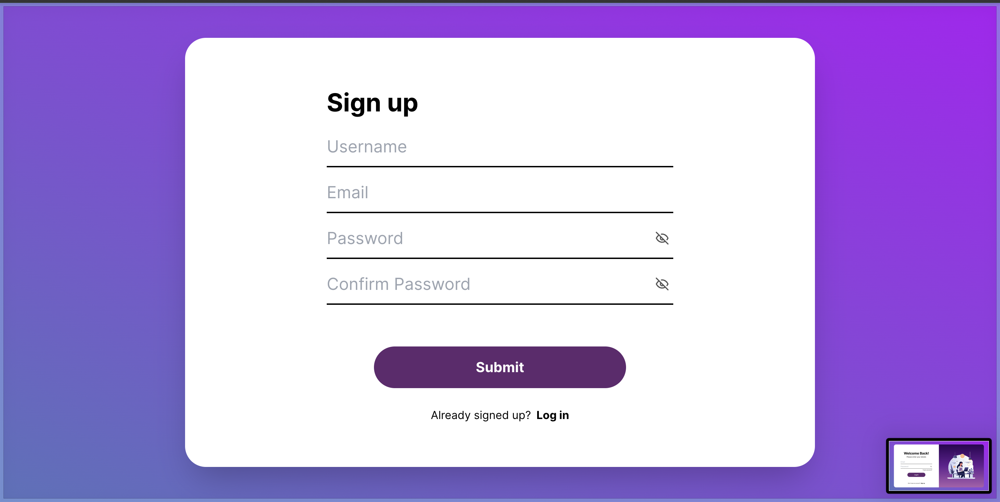
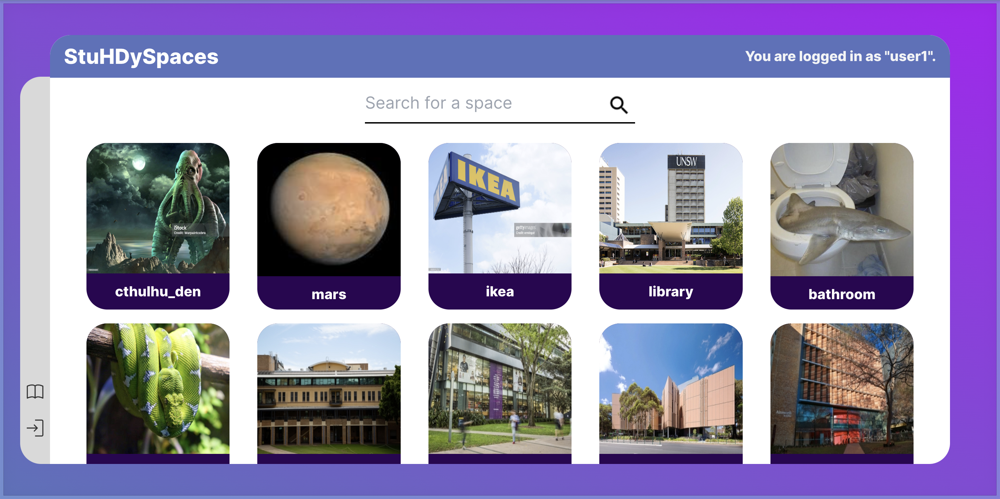

# StuHDySpaces

## Video of final product
[Project Showcase](https://youtu.be/hCvR7qp7Q0M)
## Final Product
**Register Page**

**Login Page**

**Catalogue Page**

**Space page before adding review**

**Add Review Page**

**Space page after adding review**

**Unsuccessful Search**

## Steps

1. Clone the repo.
2. Run `npm install` in the project directory
3. Run the app

## Run the app

`npm run dev` in `client/`.

## Backend 

This app now also uses a backend. Initialise it by running

`npm run start` in `server/`

## Contributing

Please wait for us leads to approve your merge before adding in.

